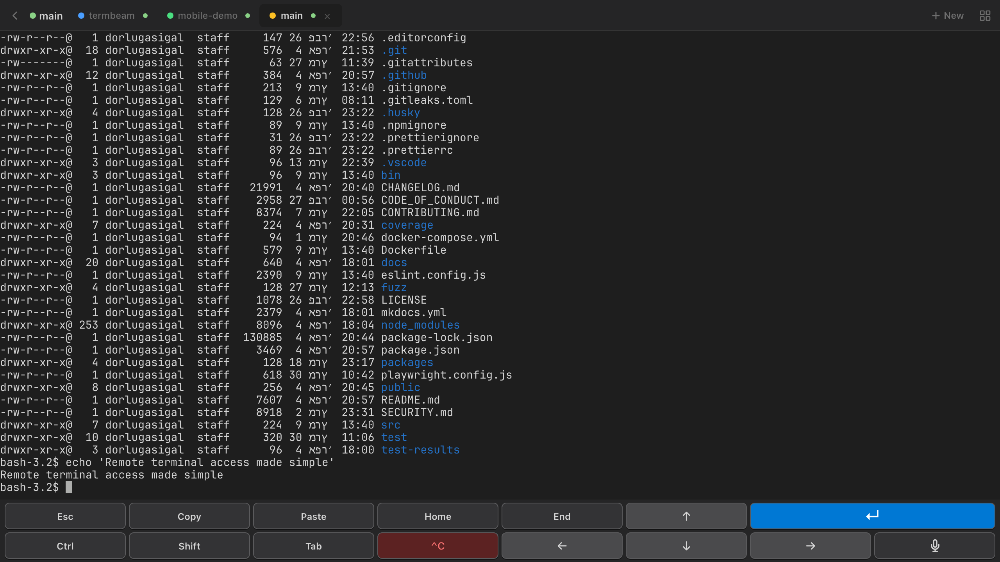
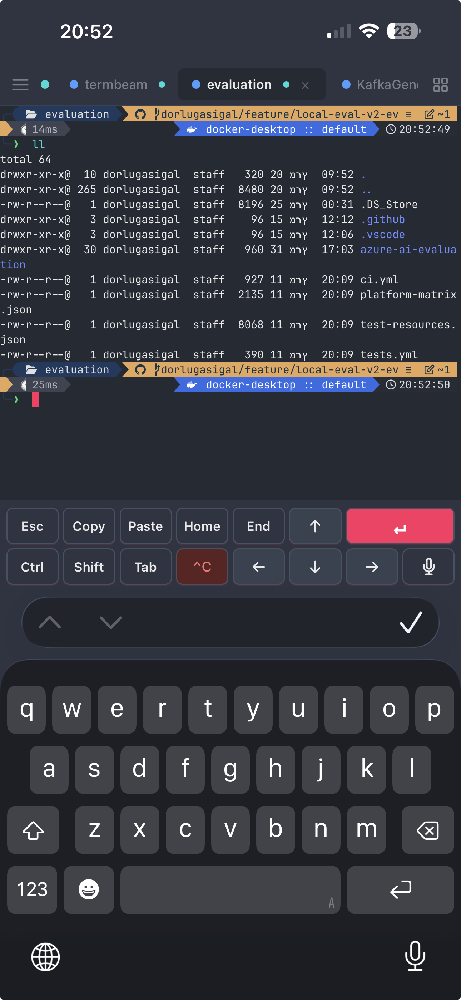
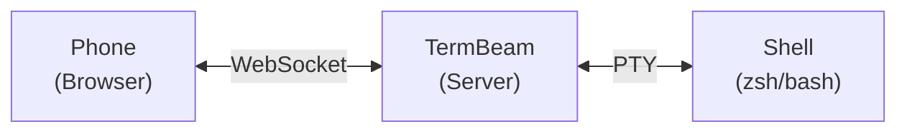

<section class="tb-hero" markdown>

 Open source · MIT licensed

<h1 class="tb-hero-title">
Beam your terminal to any device.
</h1>

One command turns your terminal into a secure, mobile-optimized web app. 
No SSH, no port forwarding — just scan the QR code.

[Get started :material-arrow-right:](getting-started.md){ .md-button .md-button--primary .tb-btn-primary }

<button class="tb-install-btn" id="tb-copy" type="button" aria-label="Copy install command">
  $npx termbeam
  ⧉
</button>

{ .tb-desktop-shot loading=eager }

{ .tb-mobile-shot loading=eager }

</section>

<section class="tb-section" markdown>

## Why TermBeam { .tb-section-title }

A terminal that goes wherever you do. Multi-session, touch-first, secure by default.

### :material-cellphone: Mobile-first

No SSH client needed. Touch-optimized key bar with arrows, Tab, Enter, Ctrl, Esc. Swipe scrolling, pinch zoom, image paste, and iPhone PWA safe areas.

### :material-tab-plus: Multi-session

Tabbed sessions, split view (horizontal on desktop, vertical on mobile), session colors, activity indicators, hover/long-press previews, and a folder browser.

### :material-magnify: Productivity

Terminal search with regex (<kbd>Ctrl+F</kbd>), command palette (<kbd>Ctrl+K</kbd>), file upload &amp; download, markdown viewer, completion notifications, 30 themes.

### :material-shield-lock: Secure by default

Password auth with auto-generation and rate limiting. httpOnly cookies. QR code auto-login with single-use share tokens. Validated shells. Optional secure tunnel.

### :material-robot: AI agent ready

Auto-detects Copilot CLI, Claude, Aider, and Codex. Launch them from the agent picker — your phone becomes a remote control for AI coding sessions.

### :material-flash: One command

`npx termbeam` and you're online. Optional secure tunnel for cellular access. Or run on LAN, or fully local. Interactive setup wizard with `termbeam -i`.

</section>

<section class="tb-section tb-section--alt" markdown>

## How it works { .tb-section-title }

#### 1 · Spawn

A lightweight server starts a PTY with your shell — `zsh`, `bash`, `pwsh`, or `cmd`.

#### 2 · Bridge

The browser connects via WebSocket. Input and output stream in real time over xterm.js.

#### 3 · Beam

A QR code (or link) opens the terminal on your phone. Use a tunnel for cellular, or stay on LAN.

</section>

<section class="tb-section tb-cta" markdown>

## Ready in 30 seconds { .tb-section-title }

Free. Open source. No account, no signup, no telemetry.

[Read the docs :material-book-open-variant:](getting-started.md){ .md-button .md-button--primary }
[Star on GitHub :material-github:](https://github.com/dorlugasigal/TermBeam){ .md-button }

</section>
